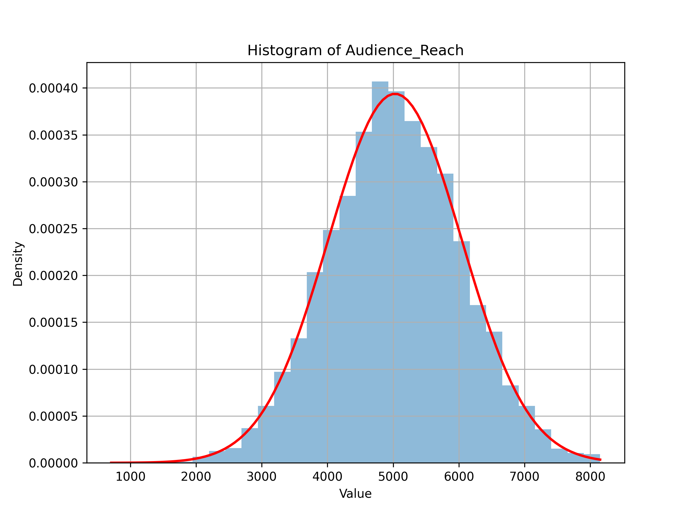
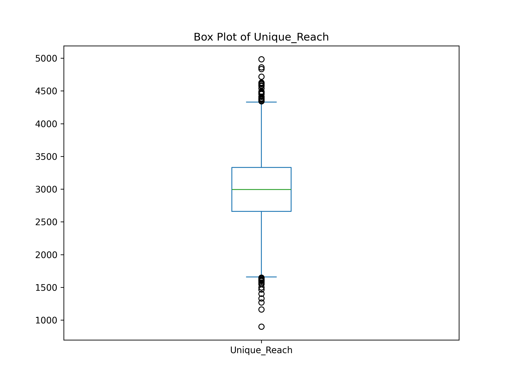
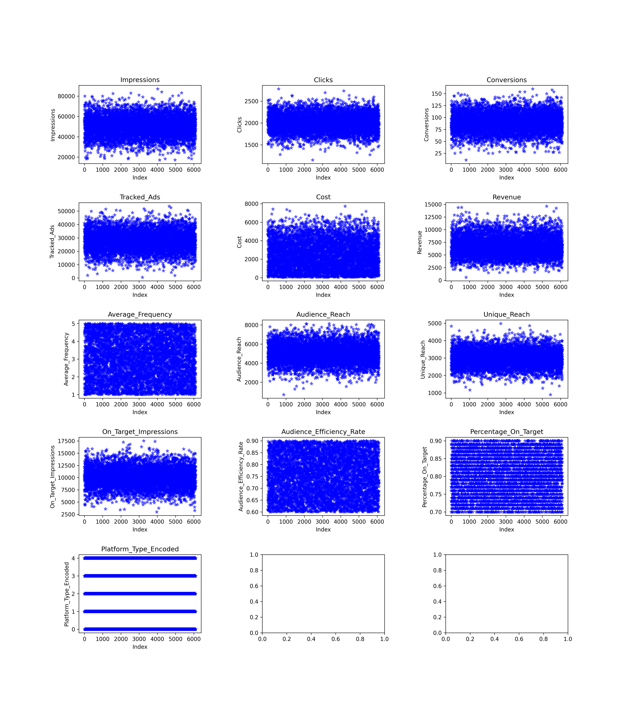

# AdRevenueForecast is a time-series forecasting app designed to predict ad campaigns revenue using Facebook Prophet model.

---

## Exploratory Data Analysis (EDA)

### 1. Data Overview

The dataset represents advertising campaigns tracked daily over four months, retrieved from a MySQL database. The main columns include:

- **Campaign_ID**: Unique identifier for each campaign.
- **Date_Time**: Date and time of data recording, allowing for temporal analysis.
- **Platform_Type**: Advertising platform (e.g., Google, Facebook), enabling performance comparison across platforms.
- **Impressions**: Number of times the ad was displayed, a key measure of visibility.
- **Clicks**: Total clicks received, indicating user engagement.
- **Conversions**: Number of successful actions (e.g., purchases) resulting from the campaigns.
- **Cost**: Total expenditure on the campaign, essential for ROI calculations.
- **Revenue**: Total income generated, directly linked to campaign success.

These metrics provide a comprehensive view of campaign performance, allowing for in-depth analysis of advertising effectiveness.

---

### 2. Data Processing
Data was fetched from a MySQL database. We converted certain columns to numeric types where applicable. The columns `Campaign_ID`, `Platform_Type` were kept as categorical variables, and `Date_Time` was transformed into date format.

---

### 3. Revenue Analysis

#### Revenue by Platform Type Over Time (Monthly)

This plot shows the revenue distribution across different platform types over the months.

#### Revenue by Platform Type Over Time (Weekly)

This plot shows the revenue distribution across different platform types on a weekly basis.

#### Revenue by Campaign Over Time (Monthly)

This visual represents how different campaigns performed in terms of revenue month-wise.

#### Revenue by Campaign Over Time (Weekly)

Similar to above but at a weekly granularity.

---

### 4. Correlation Analysis

This heatmap illustrates the correlations among various features in the dataset. Strong correlations can indicate where relationships exist.

---

### 5. Distribution of Features
Below are histograms showing the distribution of various numeric features in the dataset.

#### Histogram of Impressions

##### Histogram of Clicks

#### Histogram of Conversions

#### Histogram of Tracked Ads

#### Histogram of Cost

#### Histogram of Revenue

#### Histogram of Average Frequency

#### Histogram of Audience Reach

#### Histogram of Unique Reach

#### Histogram of On Target Impressions

#### Histogram of Audience Efficiency Rate

#### Histogram of Percentage On Target

---

### 6. Outlier Analysis
#### Box Plot of Impressions

This box plot shows the distribution of impressions and highlights potential outliers.

#### Box Plot of Clicks

#### Box Plot of Conversions

#### Box Plot of Tracked Ads

#### Box Plot of Cost

#### Box Plot of Revenue

#### Box Plot of Average Frequency

#### Box Plot of Audience Reach

#### Box Plot of Unique Reach

#### Box Plot of On Target Impressions

#### Box Plot of Audience Efficiency Rate

#### Box Plot of Percentage On Target

---

### 7. Additional Visualizations
#### Scatterplots of Key Features

These scatter plots visualize the relationships between different features.

---

### 8. Conclusion
This analysis provides valuable insights into revenue trends, correlations, distributions, and potential outliers, enabling better vision of data that we gonna use to build our Time-series model.

---